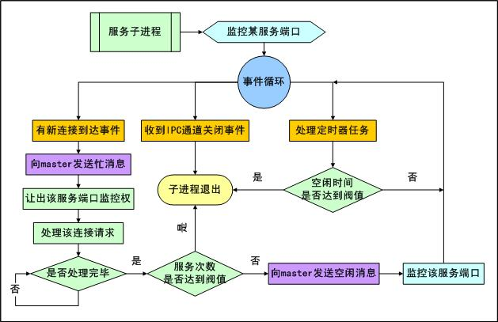
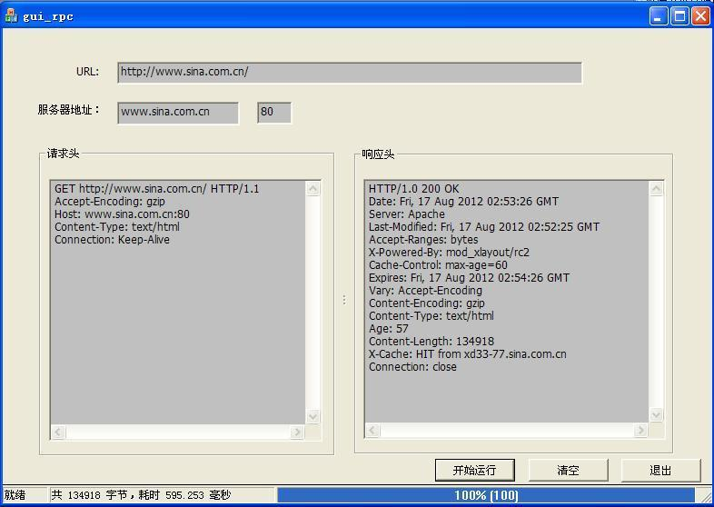

# acl -- One advanced C/C++ library for Unix/Windows.

[English](README_EN.md)

<!-- vim-markdown-toc GFM -->
* [一、描述](#一描述)
    * [1.1、库组成](#11库组成)
    * [1.2、功能模块组成](#12功能模块组成)
        * [1.2.1、网络通信库](#121网络通信库)
            * [1.2.1.1、流处理模块](#1211流处理模块)
            * [1.2.1.2、网络操作模块](#1212网络操作模块)
            * [1.2.1.3、非阻塞网络流](#1213非阻塞网络流)
            * [1.2.1.4、常见网络应用协议库](#1214常见网络应用协议库)
            * [1.2.1.5、常见网络通信库](#1215常见网络通信库)
        * [1.2.2、网络 IO 事件引擎](#122网络-io-事件引擎)
        * [1.2.3、网络服务器框架](#123网络服务器框架)
            * [1.2.3.1、进程模型](#1231进程模型)
            * [1.2.3.2、线程模型](#1232线程模型)
            * [1.2.3.3、非阻塞模型](#1233非阻塞模型)
            * [1.2.3.4、协程模型](#1234协程模型)
            * [1.2.3.5、UDP通信模型](#1235udp通信模型)
            * [1.2.3.6、触发器模型](#1236触发器模型)
        * [1.2.4、线程及线程池模块](#124线程及线程池模块)
        * [1.2.5、HTTP 协议库](#125http-协议库)
            * [1.2.5.1、客户端模式](#1251客户端模式)
            * [1.2.5.2、服务端模式](服务端模式)
        * [1.2.6、Redis 客户端库](#126redis-客户端库)
        * [1.2.7、MIME 协议库](#127mime-协议库)
        * [1.2.8、网络协程库](#128网络协程库)
        * [1.2.9、数据库相关](#129数据库相关)
        * [1.2.10、数字键的 K-V 磁盘存储模块（zdb）](#1210数字键的-k-v-磁盘存储模块zdb)
        * [1.2.11、其它功能库](#1211其它功能库)
            * [1.2.11.1、常用数据结构模块](#12111常用数据结构模块)
            * [1.2.11.2、内存操作模块](#12112-内存操作模块)
            * [1.2.11.3、常用字符串操作模块](#12113常用字符串操作模块)
            * [1.2.11.4、文件目录模块](#12114文件目录模块)
            * [1.2.11.5、读配置文件模块](#12115读配置文件模块)
            * [1.2.11.6、文件队列处理库](#12116文件队列处理库)
            * [1.2.11.7、json解析库](#12117json解析库)
            * [1.2.11.8、xml解析库](#12118xml解析库)
            * [1.2.11.9、常见编码库](#12119常见编码库)
* [二、平台支持及编译](#二平台支持及编译)
* [三、目录结构说明](#三目录结构说明)
    * [3.1、lib_acl---基础 C 库](#31lib_acl)
    * [3.2、lib_protocol---HTTP/SMTP/ICMP 协议 C 库](#32lib_protocol)
    * [3.3、lib_acl_cpp---C++ 功能库](#33lib_acl_cpp)
    * [3.4、lib_fiber---网络协程库](#34lib_fiber)
    * [3.5、图例](#35图例)
    * [3.6、acl 库中有大量示例可供参考，请参考：SAMPLES.md](#36acl-库中有大量示例可供参考请参考samplesmd)
    * [3.7、acl 使用 FAQ](#37acl-使用-faq-参考-faqmd)
* [四、谁在使用acl](#四谁在使用acl)
* [五、使用许可](#五使用许可)
* [六、参考](#六参考)

<!-- vim-markdown-toc -->

## 一、描述
acl 工程是一个跨平台（支持LINUX，WIN32，Solaris，MacOS，FreeBSD）的网络通信库及服务器编程框架，同时提供更多的实用功能库。通过该库，用户可以非常容易地编写支持多种模式(多线程、多进程、非阻塞、触发器、UDP方式、协程方式)的服务器程序，WEB 应用程序，数据库应用程序。此外，该库还提供了常见应用的客户端通信库（如：HTTP、SMTP、ICMP、redis、memcache、beanstalk、handler socket），常见流式编解码库：XML/JSON/MIME/BASE64/UUCODE/QPCODE/RFC2047 etc。

### 1.1、库组成
本工程主要包含 5 个库及大量示例。5 个库的说明如下：
1. lib_acl: 该库是最基础的库，其它 4 个库均依赖于该库; 该库以 C 语言实现。
2. lib_protocol: 该库主要实现了 http 协议及 icmp/ping 协议; 该库以 C 语言实现。
3. lib_acl_cpp: 该库用 C++ 语言封装了 lib_acl/lib_protocol 两个库，同时增加了一些其它有价值的功能应用。
4. lib_fiber: 该库为支持协程库，直接 hook 系统 read/write 等 API，与 epoll 配合支持高并发网络编程。
5. lib_dict: 该库主要实现了 KEY-VALUE 的字典式存储库，该库另外还依赖于 BDB, CDB 以及 tokyocabinet 库。
6. lib_tls: 该库封装了 openssl 库，使 lib_acl 的通信模式可以支持 ssl。

* 整体架构图
    

### 1.2、功能模块组成
#### 1.2.1、网络通信库
##### 1.2.1.1、流处理模块
该模块是整个 acl 网络通信最基础的流式通信模块，不仅支持网络流，同时还支持文件流，主要支持：
1. 按行读数据，兼容 win32 下的 \r\n，同时兼容 UNIX 下的 \n 的结束符
2. 按行读数据但要求自动去掉尾部的 \n 或 \r\n
3. 以字符串为分隔符读取数据
4. 读规定长度的数据
5. 尝试性读一行数据或尝试性读规定长度数据
6. 探测网络 IO 状态
7. 写入一行数据
8. 按格式符写入数据，类似于 fprintf
9. 文件流定位操作，类似于 fseek
10. 一次性写入一组数据，类似于 unix 下的 writev
11. 将文件截短，类似于 ftrunk
12. 获取文件大小
13. 获得当前文件流指针位置，类似于 ftell
14. 获得文件尺寸
15. 获得网络流的本地地址及远程地址

##### 1.2.1.2、网络操作模块
该模块主要支持网络服务端监听（支持 TCP/UDP/UNIX 域套接口）、网络客户端连接（支持 TCP/UNIX 域套接口）、DNS 域名查询及结果缓存（支持调用系统 gethostbyname/getaddrinfo 函数和直接发送 DNS 协议两种方式）、套接口（socket）操作及取本机网卡等功能。

##### 1.2.1.3、非阻塞网络流
支持非阻塞方式连接、读（按行读，规定长度读）、写（写行，写规定长度，写一组数据）等操作。

##### 1.2.1.4、常见网络应用协议库
主要支持常见网络应用协议，诸如：HTTP、SMTP、ICMP，其中 HTTP、ICMP 两个模块实现了阻塞、非阻塞两种通信方式；此外，HTTP 协议在C++版的 lib_acl_cpp 中还支持服务端、客户端两种通信方式，当作为服务端使用时，支持类似于 JAVA HttpServlet 的接口使用方式，当作为客户端方式使用时，支持连接池与集群管理方式，该模块同时支持 cookie、session、HTTP MIME 文件上传、分块传输、字符集自动转换、自动解压缩、断点续传等丰富的功能。

##### 1.2.1.5、常见网络通信库
支持 memcached、beanstalk、handler socket 客户端通信库，该通信库支持连接池方式。

#### 1.2.2、网络 IO 事件引擎
支持 select(UNIX/LINUX/WIN32)、poll(UNIX/LINUX)、epoll(LINUX)、kqueue(BSD)、devpoll(solaris)、iocp(WIN32)、窗口消息(WIN32) 等系统事件引擎，同时支持 Reactor 及 Proactor 两种编程模型。

#### 1.2.3、网络服务器框架
该模块是 acl 中最为重要的模块，提供了服务器编程中常用的基础设施，该服务器框架来源于著名的 Postfix，在其基础上进行了诸多扩展，目前已经支持的主要服务模型有：

##### 1.2.3.1、进程模型
一个连接一个进程，这种模型的优点是编程简单、安全稳定，缺点是并发度不高；

##### 1.2.3.2、线程模型
每个子进程是由线程池中的一组线程处理所有的客户端连接，采用 IO 事件触发方式，只有当连接有数据可读时才会将连接与一个线程进行绑定，线程处理完后立即归还给线程池，这种模型的最大优点是可以用少量的线程便可以处理大量的客户端连接，而且编程比较简单（相对于非阻塞模型）；

##### 1.2.3.3、非阻塞模型
每个子进程是由一个单独的非阻塞线程组成，该线程采用完全非阻塞 IO 方式处理外来的大量客户端连接（类似于 nginx/squid/ircd），该模型的优点是处理效率高占用资源少，可以处理大量客户端连接，缺点是编程比较复杂；

##### 1.2.3.4、协程模型
虽然非阻塞服务模型可以获得大并发处理能力，但编程复杂度较高，协程模型综合了大并发的处理能力和较低的编程复杂度的特点，使编程人员可以顺序 IO 的编程方式简单实现业务逻辑;

##### 1.2.3.5、UDP通信模型
该模型主要为了支持 UDP 网络过程而增加的服务模型；

##### 1.2.3.6、触发器模型
该模型的实例主要用来处理一些定时任务的后台服务过程（类似于系统的 crontab）。

服务器框架中的子进程实用采用半驻留服务模型，支持子进程预启动机制、最大最小进程数控制、子进程异常报警、单一进程监听多个地址（可同时监听TCP/UDP套接字以及 UNIX 域套接字）、子进程安全控制、日志输出至 syslog-ng、多进程TCP连接均匀化；采用配置文件驱动方式，每个服务一个配置文件，方便进程管理及服务进程在线升级。

#### 1.2.4、线程及线程池模块
提供了跨平台的支持 Posix 规范的线程接口（支持WIN32）；线程池模块通过多种措施最大程度地减少线程任务分配时的锁冲突（用在 acl 服务器框架中多进程多线程服务模型中）。

#### 1.2.5、HTTP 协议库
提供了完整的 HTTP 协议实现，支持 HTTP/1.0、1.1 版本; 同时支持客户端模式及服务端模式：

##### 1.2.5.1、客户端模式
1. 支持连接池方式;
2. 支持 chunked 块传输;
3. 支持压缩传输;
4. 支持 SSL 加密传输;
5. 支持断点续传;
6. 支持设置/获取 Cookies;
7. 支持 Websocket.

##### 1.2.5.2、服务端模式
1. 支持类似于 Java 的 HttpServlet 使用方式;
2. 支持 chunked 块传输;
3. 支持压缩传输;
4. 支持 SSL 加密传输;
5. 支持断点续传;
6. 支持设置/获取 Cookies;
7. 支持 HTTP MIME 格式;
8. 支持 Websocket.

#### 1.2.6、Redis 客户端库
1. 支持 redis 集群模式及非集群模式;
2. 支持连接池方式;
3. 按 redis 数据结构类型分成独立的 C++ 类;
4. 每个命令映射为 1 个至多个函数.
具体内容参考：[使用 acl 库编写高效的 C++ redis 客户端应用](http://zsxxsz.iteye.com/blog/2184744)  

#### 1.2.7、MIME 协议库
1. 支持流式 MIME 数据解析;
2. 支持 MIME RFC2045，RFC2047，RFC822.

#### 1.2.8、网络协程库
直接 hook 系统底层 IO API，与 epoll 配合实现网络 IO 的高并发、高性能编程框架，通过该模块可以使一些原生的常见阻塞式网络库（如 mysql/redis/http 等客户端库）直接支持高并发网络操作；通过使用该模块，编程者采用顺序思维编程方式，在协程库内部将阻塞模式转为非阻塞模式，因而大大提高了网络并发能力及处理性能。

#### 1.2.9、数据库相关
设计了统一的数据库操作接口及连接池处理方式，目前支持 sqlite/mysql/postgresql。

#### 1.2.10、数字键的 K-V 磁盘存储模块（zdb）
采取 KEY/VALUE 分块存储方式，因为 KEY 限定为数字类型，只需内存计算便可算出 KEY 的位置，KEY 中存放了 VALUE 的位置，所以对于任何的数据查询只需两次磁盘定位。（本人在和讯做流量统计存储时，使用该种方式替代了BSD、TC 等采用B树的 K-V 存储）。

#### 1.2.11、其它功能库

##### 1.2.11.1、常用数据结构模块
该模块提供了常见的哈希表（及多种哈希算法）、动态数组、双向链表、平衡二叉树、队列、二分块查找树、256 叉匹配树等数组结构；提供了统一的数据结构遍历方法(采用 acl_foreach)。

##### 1.2.11.2、 内存操作模块

该模块提供三种内存池模型：
1. <b>基本的内存方式：</b>内部封装了系统的 malloc/free API，提供了内存校验等安全措施；该方式同时提供外部注册接口，允许使用者注册自己的内存分配模型；
2. <b>内存片(slab) 方式：</b>根据不同的尺寸大小分配多个定长内存链，可以有效地减少内存碎片，大大提升内存分配效率；
3. <b>内存链方式：</b>将长度不一的小内存分配在一条内存页上，可以非常有效地使用内存，减少内存浪费。

##### 1.2.11.3、常用字符串操作模块
支持字符串匹配查找、前(后)向比较、字符串分割、字符串大小写转换、H2B/B2H 转换、URL 编码/解码等功能。

##### 1.2.11.4、文件目录模块
支持多级目录创建、多级目录扫描、文件句柄缓存等功能，同时在处理多级目录采用循环方式，避免了递归方式时可能的栈溢出的隐患。

##### 1.2.11.5、读配置文件模块
支持读 name=value 形式的配置文件，value 较长时可以使用反斜杠(\)折行，采用配置表方式提取配置文件中的配置项。

##### 1.2.11.6、文件队列处理库
支持多组目录队列文件的创建、扫描、删除等操作；常用于临时文件队列调度的服务程序中。

##### 1.2.11.7、json 解析库
支持流式方式解析 json 数据，同时支持 json 数据包组装。

##### 1.2.11.8、xml 解析库
支持流式方式解析 xml 数据，同时支持 xml 数据包组装。

##### 1.2.11.9、常见编码库
还包括 rfc2047、url、base64、uucode、qpcode、charset 等编解码库，这些解码库均采用流式解析方式，适合于多种网络 IO 模型（阻塞/非阻塞TCP、UDP）。

## 二、平台支持及编译
整个工程目前支持 Linux(AS4,5,6, CS4,5,6, ubuntu), Windows, MacOS, FreeBSD, Solaris，Android，IOS。
* Linux/UNIX: 编译器为 gcc，直接在终端命令行方式下分别进入 lib_acl/lib_protocol/lib_acl_cpp 目录下，运行 make 命令即可。
* Windows: 可以用 VC2003/VC2008/VC2010/VC2012/vc2013/vc2015 进行编译。(如果需要用 VC6/VC2005 编译，可以参考 VC2003 的编译条件)。
* MacOS：可使用 xcode 进行编译。
* 同时支持 CMake 跨平台编译方式

当在 WIN32 环境下使用动态库时有几点需要注意：
* 使用 lib_acl 的动态库时，需要在用户的工程预定义: ACL_DLL;
* 使用 lib_protocol 动态库中的 HTTP 库或 ICMP 库时，需要在工程中预定义 HTTP_DLL 或 ICMP_DLL;
* 使用 lib_acl_cpp 的动态库时，需要在工程中预定义 ACL_CPP_DLL，如果您使用用 VC2003 编译环境则还需要预定义 VC2003;
* 使用 lib_dict 的动态库时，需要在工程中预定义 DICT_DLL;
* 使用 lib_tls 的动态库时，需要在工程中预定义 TLS_DLL。
* 详细编译过程，参见：[acl 库的编译及使用](BUILD.md)

## 三、目录结构说明

### 3.1、lib_acl
1. init : 主要用于初始化 acl 基础库
2. stdlib : 是一些比较基础的功能函数库，在 stdlib/ 根目录下主要包括一些有关日志记录、网络/文件流处理、VSTRING缓冲操作等功能函数；在 stdlib/ 下还有二级目录，如下：
-    2.1 common : 该目录主要为一些常用的数据结构及算法的功能函数库，象哈希表、链表、队列、动态数组、堆栈、缓存、平衡二叉树、模式匹配树等；
-    2.2 memory : 该目录主要包含与内存操作相关的函数库，象内存基础分配与校验、内存池管理、内存切片管理等；
-    2.3 filedir : 该目录主要包含与目录遍历、目录创建等相关的库；
-    2.4 configure : 该目录主要包含配置文件的分析库；
-    2.5 iostuff : 该目录主要包含一些常用的IO操作的函数库，象读/写超时、设置IO句柄的阻塞模式等；
-    2.6 string : 该目录主要包含一些常用的字符串操作的库，提供了比标准C更灵活高效的字符串操作功能；
-    2.7 debug : 主要用于协助调试内存的泄露等功能；
-    2.8 sys : 主要是与不同操作系统平台相关的API的封装函数库；
3. **net: 是与网络操作相关的函数库，包含网络监听、网络连接、DNS查询、套接口参数设置等功能；**
-    3.1 connect : 主要是与网络连接相关的函数库，包含网络连接、域套接口连接等；
-    3.2 listen : 主要是与网络监听相关的函数库，包含网络监听、域套接口监听等；
-    3.3 dns : 主要是与DNS域名查询相关的函数库，包含对 gethostbyname 等接口的封装、按RFC1035标准直接发送UDP包方式进行查询等功能；
4. **event : 主要封装了 select/poll/epoll/iocp/win message/kqueue/devpoll 等系统API接口，使处理网络事件更加灵活、高效、简单，另外还包含定时器接口，acl 中的很多网络应用都会用到这些接口，象 aio、master 等模块；**
5. **aio : 主要包含网络异步操作的功能函数，该套函数库在处理高并发时有非常高的效率，而且提供了比基础API更为高级的调用方式，比使用象 libevent 之类的函数库更为简单，而且是线程安全的；**
6. msg : 主要包含了基于线程的消息事件及基于网络的消息事件功能；
7. thread : 主要是封装了各个OS平台下的基础线程API，使对外接口保持一致性，消除了平台的差异性，同时还提供了半驻留线程池的函数库，以及对于线程局部变量的扩展；
8. db : 主要是一些与数据库有关的功能库，定义了一个通用的数据库连接池的框架（并且实现了mysql的连接池实例）；一个简单的内存数据库（由哈希表、链表、平衡二叉树组合而成）；ZDB数据存储引擎，这是一个高效的基于数字键的存储引擎；
9. proctl : win32 平台下父子进程控制功能库；
10. code : 常见编码函数库，包括 base64编解码、URL编解码以及一些汉字字符集编码等；
11. unit_test : 包含有关进行 C 语言单元测试的功能库；
12. xml: 是一个流式的 xml 解析器及构造器，可以支持阻塞及阻塞式网络通信；
13. json: 是一个流式的 json 解析器及构造器，可以支持阻塞及阻塞式网络通信；
14. **master: 是在 UNIX 环境下支持多种服务器模式的服务器框架，目前主要支持多进程模式、多进程多线程模式、多进程非阻塞模式、多进程触发器模式及 UDP 通信模式；**

### 3.2、lib_protocol
1. http: HTTP 协议相关的库，支持 HTTP/1.1，通讯方式支持同步/异步方式
2. icmp: icmp/ping 协议库，支持同步/异步通信方式
3. smtp: 邮件客户端发信协议库

### 3.3、lib_acl_cpp
1. stdlib: 主要包含字符串处理类(string)，xml/json 解析库，zlib 压缩库(依赖于 zlib 库), 日志记录类, 字符集转码(在UNIX环境下需要 iconv 库), memcached 客户库, 互斥类(支持线程锁、文件锁);
2. **stream: 支持网络流/文件流，支持阻塞/非阻塞两种通信方式，在非阻塞模式下支持 select/poll/epoll/iocp/win32 message/kqueue/devpoll；支持 ssl 加密传输(阻塞及非阻塞方式，需要 polarssl库);**
3. ipc: 在非阻塞通信方式，提供了阻塞模块与非阻塞模块整合的方式;
4. **http: 比较完整的 HTTP 通信库及协议解析库，支持客户端及服务端模式，支持 ssl/gzip 传输方式; 支持类似于 Java HttpServlet 方式的大部分接口，方便编写 CGI 及 WEB 服务器程序；**
5. db: 封装了 MYSQL/SQLITE 库，支持数据库连接池；
6. hsocket: 实现了完整的 handler-socket 客户端通信库；
7. **mime: 支持完整的与邮件编码相关的库(邮件的 rfc2045-rfc2047/rfc822/base64/uucode 编码及解码库).**
8. **master: 封装了 C 库的服务器框架库**
9. beanstalk: 消息队列应用 beanstalkd 的客户端通信库，支持连接池
10. connpool: 通用的连接池库
11. hscoket: mysql 插件 handle-socket 的客户端通信库，支持连接池
12. memcache: memcached 应用的客户端库，支持连接池及连接池集群管理
13. queue: 磁盘文件队列操作库
14. ipc: 阻塞/非阻塞通信整合库
15. session: HTTP 会话库
16. **redis: 完整实现了 redis 协议的客户端通信库(总共 12 个大类，150 多个命令)，支持连接池及连接池集群管理**
17. disque: 支持集群消息队列服务 disque 的客户端库，支持连接池及连接池集群管理

### 3.4、lib_fiber
1. c 目录：该目录下主要为 C 语言版本实现的网络协程库，其中包含源文件及头文件
2. cpp 目录：该目录下封装了 C 语言版本的网络协程库
3. samples 目录：该目录下有大量的使用协程库编程的例子

### 3.5、图例
*    类索引图：
     
*    异步 IO 类继承图
     
*    IO 流继承图
     
*    acl 服务框架守护进程事件处理流程
     
*    acl 服务器框架子进程事件处理流程
     
*    接收上传文件的 CGI 程序：
     
*    文件下载客户端程序：
     
*    网页下载程序：
     

### 3.6、acl 库中有大量示例可供参考，请参考：[SAMPLES.md](SAMPLES.md)
### 3.7、acl 使用 FAQ 参考 [FAQ.md](FAQ.md)

## 四、谁在使用acl

## 五、使用许可
- LGPL-v3 license (see [LICENSE.txt](LICENSE.txt) in the acl project)

## 六、参考
- WEB 站点: https://blog.csdn.net/zsxxsz
- Github:   https://github.com/acl-dev/acl
- Oschina:  https://gitee.com/acl-dev/acl
- Download: https://sourceforge.net/projects/acl
- 微 博：   http://weibo.com/zsxxsz
- QQ 群:    242722074
