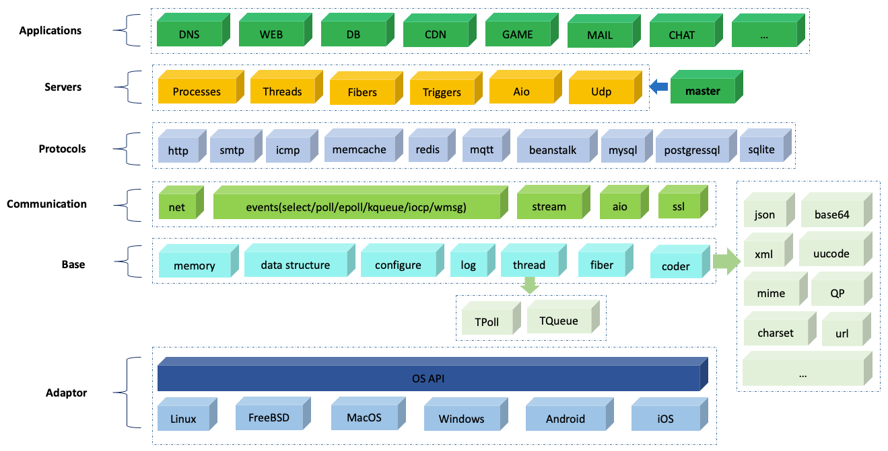
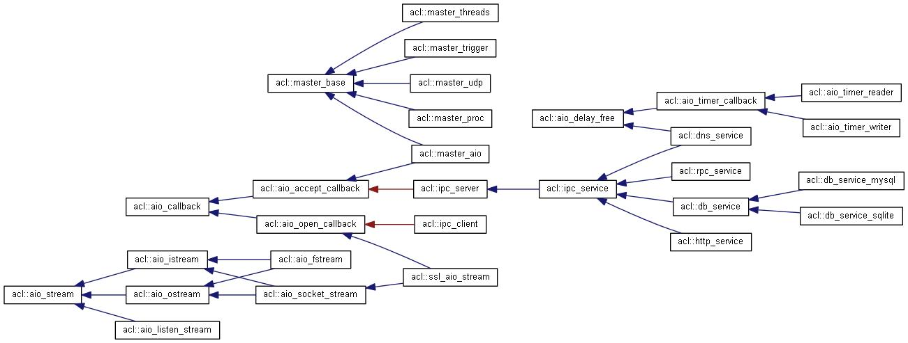

# acl -- One advanced C/C++ library for Unix/Windows.

<!-- vim-markdown-toc GFM -->
* [1 Description](#1-Description)
    * [1.1 Library composition](#11-Library-composition)
    * [1.2 Function module composition](#12-Function-module-composition)
        * [1.2.1 Network communication library](#121-Network-communication-library)
            * [1.2.1.1 Stream processing module](#1211-Stream-processing-module)
            * [1.2.1.2 Network operation module](#1212-Network-operation-module)
            * [1.2.1.3 Non-blocking network flow](#1213-Non-blocking-network-flow)
            * [1.2.1.4 Common network application protocol Library](#1214-Common-network-application-protocol-library)
            * [1.2.1.5 Common network communication library](#1215-Common-network-communication-library)
        * [1.2.2 Network IO event engine](#122-Network-io-event-engine)
        * [1.2.3 Web server framework](#123-Web-server-framework)
            * [1.2.3.1 Process model](#1231-Process-model)
            * [1.2.3.2 Thread model](#1232-Thread-model)
            * [1.2.3.3 Non-blocking model](#1233-Non-blocking-model)
            * [1.2.3.4 Coroutine model](#1234-Coroutine-model)
            * [1.2.3.5 UDP communication model](#1235-UDP-communication-model)
            * [1.2.3.6 Trigger model](#1236-Trigger-model)
        * [1.2.4 Thread and thread pool module](#124-Thread-and-thread-pool-module)
        * [1.2.5 HTTP protocol](#125-HTTP-protocol)
            * [1.2.5.1 Client mode](#1251-Client-mode)
            * [1.2.5.2 Server mode](#1252-Server-mode)
        * [1.2.6 Redis client library](#126-Redis-client-library)
        * [1.2.7 MIME protocol library](#127-Mime-protocol-library)
        * [1.2.8 Network coroutine library](#128-Network-coroutine-library)
        * [1.2.9 Database related](#129-Database-related)
        * [1.2.10 K-V disk storage module (zdb) for numeric keys](#1210-Numeric-key-K-V-disk-storage-module-zdb)
        * [1.2.11 Other function libraries](#1211-Other-function-libraries)
            * [1.2.11.1 Common data structure module](#12111-Common-data-structure-module)
            * [1.2.11.2 Memory operation module](#12112-Memory-operation-module)
            * [1.2.11.3 Common string operation module](#12113-Common-string-operation-module)
            * [1.2.11.4 File Directory module](#12114-File-Directory-module)
            * [1.2.11.5 Read configuration file module](#12115-Read-configuration-file-module)
            * [1.2.11.6 File queue processing library](#12116-File-queue-processing-library)
            * [1.2.11.7 Json parsing library](#12117-Json-parsing-library)
            * [1.2.11.8 Xml parsing library](#12118-Xml-parsing-library)
            * [1.2.11.9 Common coding library](#12119-Common-coding-library)
* [2 Platform support and compilation](#2-Platform-support-and-compilation)
* [3 Description of directory structure](#3-Description-of-directory-structure)
    * [3.1 lib_acl---Basic C library](#31-lib_acl)
    * [3.2 lib_protocol---HTTP/SMTP/ICMP Protocol C Library](#32-lib_protocol)
    * [3.3 lib_acl_cpp---C++ Function Library](#33-lib_acl_cpp)
    * [3.4 lib_fiber---network coroutine library](#34-lib_fiber)
    * [3.5 Legend](#35-Legend)
    * [3.6 There are a lot of examples in the acl library for reference, please refer to: SAMPLES.md](#36-There-are-a-lot-of-examples-in-the-acl-library-for-reference-please-refer-to-samplesmd)
    * [3.7 Acl using FAQ](#37-Acl-using-FAQ-faqmd)
* [4 Who are using acl](#4-Who-are-using-acl)
* [5 License](#5-License)
* [6 Reference](#6-Reference)

<!-- vim-markdown-toc -->

## 1 Description
The acl project is a cross-platform (supporting LINUX, WIN32, Solaris, MacOS, FreeBSD) network communication library and server programming framework, while providing more useful functional libraries. Through this library, users can easily write server programs, WEB applications, and database applications that support multiple modes (multi-threaded, multi-process, non-blocking, trigger, UDP, and coroutine). In addition, the library also provides client communication libraries for common applications (such as: HTTP, SMTP, ICMP, redis, memcache, beanstalk, handler socket), common streaming codec library: XML/JSON/MIME/BASE64/UUCODE/ QPCODE/RFC2047 etc.

### 1.1 Library composition
This project consists of 5 libraries and a large number of examples. The description of the five libraries is as follows:
1. lib_acl: This library is the most basic library, the other four libraries are dependent on the library; the library is implemented in C language.
2. lib_protocol: This library mainly implements the http protocol and the icmp/ping protocol; the library is implemented in C language.
3. lib_acl_cpp: This library encapsulates the lib_acl/lib_protocol libraries in C++ and adds some other valuable functional applications.
4. lib_fiber: This library supports the coroutine library, directly hooks the system read/write API, and supports high-concurrency network programming with epoll.
5. lib_dict: This library mainly implements the dictionary storage of KEY-VALUE, which also depends on BDB, CDB and tokyocabinet libraries.
6. lib_tls: This library encapsulates the openssl library so that the communication mode of lib_acl can support ssl.

* Overall architecture diagram
    

### 1.2 Function module composition
#### 1.2.1 Network communication library
##### 1.2.1.1 Stream processing module
This module is the most basic streaming communication module for the entire acl network communication. It not only supports network streaming, but also supports file streaming. It mainly supports:
1. Read data by line, compatible with \r\n under win32, and compatible with the end of \n under UNIX
2. Read data by line but require automatic removal of the trailing \n or \r\n
3. Read data as a string separator
4. Read the specified length of data
5. Try to read a row of data or try to read the specified length of data
6. Detect network IO status
7. Write a row of data
8. Write data by formatter, similar to fprintf
9. File stream location operation, similar to fseek
10. Write a set of data at once, similar to writev under unix
11. Truncate the file, similar to ftrunk
12. Get the file size
13. Get the current file stream pointer location, similar to ftell
14. Get the file size
15. Obtain the local address and remote address of the network stream

##### 1.2.1.2 Network operation module
This module mainly supports network server monitoring (supports TCP/UDP/UNIX domain socket), network client connection (supports TCP/UNIX domain socket), DNS domain name query and result cache (supports calling system gethostbyname/getaddrinfo function and direct Send DNS protocol two ways), socket (socket) operation and take the local network card and other functions.

##### 1.2.1.3 Non-blocking network flow
Support non-blocking mode connection, read (by row read, specified length read), write (write line, write specified length, write a set of data) and other operations.

##### 1.2.1.4 Common network application protocol library
It mainly supports common network application protocols, such as: HTTP, SMTP, ICMP, in which HTTP and ICMP modules implement blocking and non-blocking communication methods. In addition, the HTTP protocol supports server and client in C++ version of lib_acl_cpp. Two communication methods, when used as a server, support the interface usage similar to JAVA HttpServlet. When used as a client mode, it supports connection pool and cluster management. The module supports both cookie, session, and HTTP MIME file upload. Rich functions such as block transfer, automatic character set conversion, automatic decompression, and breakpoint resume.

##### 1.2.1.5 Common network communication library
Support memcached, beanstalk, handler socket client communication library, the communication library supports connection pool mode.

#### 1.2.2 Network IO event engine
Supports select (UNIX/LINUX/WIN32), poll (UNIX/LINUX), epoll (LINUX), kqueue (BSD), devpoll (solaris), iocp (WIN32), window message (WIN32) and other system event engines, and supports Reactor And Proactor two programming models.

#### 1.2.3 Web server framework
This module is the most important module in acl, and provides the infrastructure commonly used in server programming. The server framework is derived from the famous Postfix. It has been expanded on the basis of the following. The main service models that have been supported are:

##### 1.2.3.1 Process model
One connection to a process, the advantage of this model is that the programming is simple, safe and stable, and the disadvantage is that the degree of concurrency is not high;

##### 1.2.3.2 Thread model
Each child process handles all client connections by a group of threads in the thread pool. The IO event trigger mode is used. The connection is bound to a thread only when the connection has data readable. The thread is returned immediately after processing. For the thread pool, the biggest advantage of this model is that it can handle a large number of client connections with a small number of threads, and the programming is relatively simple (relative to the non-blocking model);

##### 1.2.3.3 Non-blocking model
Each child process consists of a single non-blocking thread that handles a large number of foreign client connections (similar to nginx/squid/ircd) in a completely non-blocking IO manner. The advantage of this model is that it has high processing efficiency and low resource consumption. Can handle a large number of client connections, the disadvantage is that programming is more complicated;

##### 1.2.3.4 Coroutine model
Although the non-blocking service model can obtain large concurrent processing capability, the programming complexity is high. The coroutine model combines the features of large concurrent processing and low programming complexity, enabling programmers to easily implement sequential IO programming. Business logic;

##### 1.2.3.5 UDP communication model
The model is mainly used to support the UDP network process and the service model is added;

##### 1.2.3.6 Trigger model
The model instance is mainly used to process the background service process of some scheduled tasks (similar to the system's crontab).

The sub-process utility in the server framework adopts the semi-resident service model, supports the sub-process pre-boot mechanism, the maximum and minimum process number control, the sub-process abnormal alarm, and the single process to listen to multiple addresses (can simultaneously listen to TCP/UDP sockets and UNIX). Domain sockets), child process security control, log output to syslog-ng, multi-process TCP connection uniformity; configuration file-driven mode, one configuration file per service, convenient process management and online upgrade of service process.

#### 1.2.4 Thread and thread pool module
Provides a cross-platform support for the Posix-compliant thread interface (WIN32 support); the thread pool module minimizes lock conflicts in thread task allocation (used in the multi-process multi-threaded service model in the acl server framework).

#### 1.2.5 HTTP protocol
Provides a complete HTTP protocol implementation, supports HTTP/1.0, 1.1 version; supports both client mode and server mode:

##### 1.2.5.1 Client mode
1. Support connection pool mode;
2. Support chunked block transfer;
3. Support compressed transmission;
4. Support SSL encrypted transmission;
5. Support for resumed breakpoints;
6. Support setting/acquisition of cookies;
7. Support Websocket.

##### 1.2.5.2 Server mode
1. Support Java-like HttpServlet usage;
2. Support chunked block transfer;
3. Support compressed transmission;
4. Support SSL encrypted transmission;
5. Support for resumed breakpoints;
6. Support setting/acquisition of cookies;
7. Support HTTP MIME format;
8. Support Websocket.

#### 1.2.6 Redis client library
1. Support redis cluster mode and non-cluster mode;
2. Support connection pool mode;
3. Divide into separate C++ classes according to the redis data structure type;
4. Each command is mapped to 1 to more functions.
Specific content reference: [Use the acl library to write efficient C++ redis client application] (http://zsxxsz.iteye.com/blog/2184744)

#### 1.2.7 MIME protocol library
1. Support streaming MIME data parsing;
2. Support MIME RFC2045, RFC2047, RFC822.

#### 1.2.8 Network coroutine library
Direct hook system The underlying IO API, in conjunction with epoll, implements a high-concurrency, high-performance programming framework for network IO. This module enables some native common blocking network libraries (such as client libraries such as mysql/redis/http) to directly support high Concurrent network operation; by using this module, the programmer uses the sequential thinking programming method to change the blocking mode to the non-blocking mode inside the coroutine library, thus greatly improving the network concurrency and processing performance.

#### 1.2.9 Database related
Designed a unified database operation interface and connection pool processing, currently supports sqlite/mysql/postgresql.

#### 1.2.10 Numeric key K-V disk storage module (zdb)
Take the KEY/VALUE block storage method, because the KEY is limited to the numeric type, you only need the memory calculation to calculate the position of the KEY, and the KEY stores the location of the VALUE, so you only need two disk positioning for any data query. (I used this method to replace K-V storage using B-trees such as BSD and TC when doing traffic statistics storage.)

#### 1.2.11 Other function libraries

##### 1.2.11.1 Common data structure module
The module provides common hash tables (and multiple hash algorithms), dynamic arrays, doubly linked lists, balanced binary trees, queues, binary search trees, 256-fork matching trees, and other array structures; provides a unified data structure traversal method (using acl_foreach).

##### 1.2.11.2 Memory operation module

This module provides three memory pool models:
1. <b>Basic memory mode:</b> The system's malloc/free API is encapsulated internally to provide security measures such as memory verification. This method also provides an external registration interface that allows users to register their own memory allocation models. ;
2. <b>memory slice (slab) mode:</b> allocate multiple fixed-length memory chains according to different sizes, which can effectively reduce memory fragmentation and greatly improve memory allocation efficiency;
3. <b>memory chain mode:</b> Allocate small memory of different lengths on one memory page, which can use memory very effectively and reduce memory waste.

##### 1.2.11.3 Common string operation module
Supports string matching lookup, pre (post) comparison, string splitting, string case conversion, H2B/B2H conversion, URL encoding/decoding, etc.

##### 1.2.11.4 File directory module
Support multi-level directory creation, multi-level directory scanning, file handle caching, etc., while processing multi-level directories in a round-robin manner, avoiding the potential for stack overflow in recursive mode.

##### 1.2.11.5 Read configuration file module
Supports reading the configuration file of the name=value format. When the value is long, you can use the backslash (\) to wrap the line, and use the configuration table to extract the configuration items in the configuration file.

##### 1.2.11.6 File queue processing library
Supports the creation, scanning, and deletion of multiple sets of directory queue files; it is commonly used in service programs for temporary file queue scheduling.

##### 1.2.11.7 Json parsing library
Supports streaming parsing of json data while supporting json packet assembly.

##### 1.2.11.8 Xml parsing library
Support streaming methods to parse xml data while supporting xml packet assembly.

##### 1.2.11.9 Common coding library
It also includes codecs such as rfc2047, url, base64, uucode, qpcode, charset, etc. These decoding libraries are all streamed and are suitable for multiple network IO models (blocking/non-blocking TCP, UDP).

## 2 Platform support and compilation
The entire project currently supports Linux (AS4, 5, 6, CS4, 5, 6, ubuntu), Windows, MacOS, FreeBSD, Solaris, Android, IOS.
* Linux/UNIX: The compiler is gcc, enter the lib_acl/lib_protocol/lib_acl_cpp directory directly in the terminal command line mode, run the make command.
* Windows: Can be compiled with VC2003/VC2008/VC2010/VC2012/vc2013/vc2015. (If you need to compile with VC6/VC2005, you can refer to the compilation conditions of VC2003).
* MacOS: Compiled with xcode.
* Support for CMake cross-platform compilation

There are a few things to keep in mind when using dynamic libraries in a WIN32 environment:
* When using the dynamic library of lib_acl, it needs to be predefined in the user's project: ACL_DLL;
* When using the HTTP library or ICMP library in the lib_protocol dynamic library, you need to predefine HTTP_DLL or ICMP_DLL in the project;
* When using the dynamic library of lib_acl_cpp, you need to predefine ACL_CPP_DLL in the project. If you use the VC2003 compiler environment, you need to predefine VC2003.
* When using the dynamic library of lib_dict, you need to predefine DICT_DLL in the project;
* When using a dynamic library of lib_tls, you need to predefine TLS_DLL in your project.
* Detailed compilation process, see: [compilation and use of acl library] (BUILD.md)

## 3 Description of directory structure

### 3.1 lib_acl
1. init : mainly used to initialize the acl base library
2. stdlib: is a relatively basic function library. In the stdlib/ root directory, it mainly includes some functions related to logging, network/file stream processing, VSTRING buffer operation, etc. There are two directories under stdlib/, as follows :
- 2.1 common : This directory is mainly used for some commonly used data structures and algorithmic function libraries, such as hash tables, linked lists, queues, dynamic arrays, stacks, caches, balanced binary trees, pattern matching trees, etc.
- 2.2 memory : This directory mainly contains function libraries related to memory operations, such as memory base allocation and verification, memory pool management, memory slice management, etc.
- 2.3 filedir: This directory mainly contains libraries related to directory traversal, directory creation, etc.
- 2.4 configure : This directory mainly contains the analysis library of the configuration file;
- 2.5 iostuff: This directory mainly contains some commonly used function libraries for IO operations, such as read/write timeout, setting the blocking mode of IO handles, etc.
- 2.6 string : This directory mainly contains some commonly used string manipulation libraries, providing more flexible and efficient string manipulation functions than standard C;
- 2.7 debug : Mainly used to assist in debugging memory leaks and other functions;
- 2.8 sys: is mainly a package function library of APIs related to different operating system platforms;
3. **net: is a function library related to network operation, including network monitoring, network connection, DNS query, socket parameter setting and other functions;
- 3.1 connect : Mainly a function library related to network connection, including network connection, domain socket connection, etc.;
- 3.2 listen : Mainly related to the network monitoring function library, including network monitoring, domain socket monitoring, etc.;
- 3.3 dns: Mainly related to the DNS domain name query, including the encapsulation of interfaces such as gethostbyname, and the ability to directly send UDP packets according to the RFC1035 standard.
4. **event: Mainly encapsulates system API interfaces such as select/poll/epoll/iocp/win message/kqueue/devpoll, which makes handling network events more flexible, efficient, and simple. It also includes timer interface, many in acl. Network applications will use these interfaces, such as aio, master and other modules; **
5. **aio: A function that mainly contains asynchronous operations on the network. This library is very efficient when dealing with high concurrency, and provides a more advanced calling method than the base API, than using a file like libevent. The library is simpler and thread safe;**
6. msg: mainly contains thread-based message events and network-based message events;
7. thread: Mainly encapsulates the basic thread API under each OS platform, which makes the external interface consistent, eliminates the difference of the platform, and also provides a semi-resident thread pool function library, as well as thread-local variables. Expansion
8. db: Mainly some database-related function libraries, defines a common database connection pool framework (and implements mysql connection pool instance); a simple in-memory database (by hash table, linked list, balanced binary tree) Combined); ZDB data storage engine, which is an efficient digital key-based storage engine;
9. proctl: the parent and child process control function library under the win32 platform;
10. code : Common coding function library, including base64 codec, URL codec and some Chinese character set encoding;
11. unit_test : contains a library of functions for testing C language units;
12. xml: is a streaming xml parser and constructor that supports blocking and blocking network communication;
13. json: is a streaming json parser and constructor that supports blocking and blocking network communications;
14. **master: is a server framework that supports multiple server modes in the UNIX environment. Currently, it supports multi-process mode, multi-process multi-thread mode, multi-process non-blocking mode, multi-process trigger mode and UDP communication mode; *

### 3.2 lib_protocol
1. http: HTTP protocol related library, support HTTP/1.1, communication mode supports synchronous/asynchronous mode
2. icmp: icmp/ping protocol library, supporting synchronous/asynchronous communication
3. smtp: mail client sending protocol library

### 3.3 lib_acl_cpp
1. stdlib: mainly contains string processing class (string), xml/json parsing library, zlib compression library (depends on zlib library), logging class, character set transcoding (ivel library is required in UNIX environment), memcached client Library, mutual exclusion class (supports thread lock, file lock);
2. **stream: Supports network flow/file flow, supports blocking/non-blocking communication modes, supports select/poll/epoll/iocp/win32 message/kqueue/devpoll in non-blocking mode; supports ssl encrypted transmission (blocking) And non-blocking mode, need polarsl library); **
3. ipc: provides a way to integrate blocking modules with non-blocking modules in non-blocking communication mode;
4. **http: A complete HTTP communication library and protocol parsing library, support client and server mode, support ssl/gzip transmission mode; support most interfaces similar to Java HttpServlet mode, convenient to write CGI and WEB server programs ;**
5. db: encapsulates the MYSQL/SQLITE library and supports database connection pooling;
6. hsocket: implements the complete handler-socket client communication library;
7. **mime: Supports complete library related to mail encoding (rfc2045-rfc2047/rfc822/base64/uucode encoding and decoding library for mail).**
8. **master: Server framework library that encapsulates the C library**
9. beanstalk: message queue application beanstalkd client communication library, support connection pool
10. connpool: Universal connection pool library
11. hscoket: mysql plugin handle-socket client communication library, support connection pool
12. memcache: client library of memcached application, support connection pool and connection pool cluster management
13. queue: disk file queue operation library
14. ipc: Blocking/non-blocking communication integration library
15. session: HTTP session library
16. **redis: Full implementation of the redis protocol client communication library (12 major categories, more than 150 commands), support connection pooling and connection pool cluster management**
17. disque: Support for cluster message queue service disque client library, support connection pool and connection pool cluster management

### 3.4 lib_fiber
1. c directory: This directory is mainly a network coroutine library implemented in C language version, which contains source files and header files.
2. cpp directory: This directory contains the C language version of the network coroutine library
3. samples directory: There are a lot of examples in this directory using the programming of the coroutine library.

### 3.5 Legend
* Class index map:
     
* Asynchronous IO class inheritance graph
     
* IO stream inheritance graph
     
* acl service framework daemon event processing flow
     ![acl service daemon event processing flow] (res/img/acl_master.jpg)
* acl server framework child process event processing flow
     ![Service Child Process Event Flow] (res/img/master_proc.jpg)
* Receive a CGI program that uploads files:
     ![CGI program to receive uploaded files] (res/img/cgi_upload.jpg)
* File download client program:
     ![File Download Client Program] (res/img/http_download.jpg)
* Web downloader:
     

### 3.6 There are a lot of examples in the acl library for reference, please refer to: [SAMPLES.md](SAMPLES.md)
### 3.7 Acl using FAQ: [FAQ.md](FAQ.md)

## 4 Who are using acl?

## 5 License
- LGPL-v3 license (see [LICENSE.txt](LICENSE.txt) in the acl project)

## 6 Reference
- WEB site: https://blog.csdn.net/zsxxsz
- Github:   https://github.com/acl-dev/acl
- Oschina:  https://gitee.com/acl-dev/acl
- Download: https://sourceforge.net/projects/acl
- Weibo:    http://weibo.com/zsxxsz
- QQ Group: 242722074
